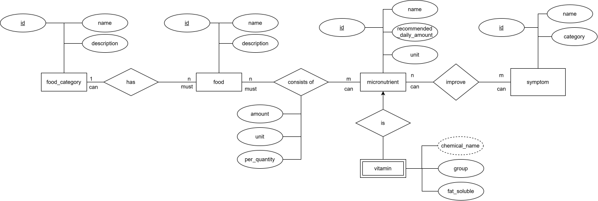

TODO:

- Add get funcionality
- Add develop service to docker compose + create Dockerfile

# [IN PROGRESS] Micronutrients 🥦📊🧬

Micronutrients is a containerized **Python** backend project focused on **relational database design** and **REST API** development for persisting, manipulating and retrieving information about micronutrients.

The database is designed using an **Entity-Relationship Model (ERM)**, transformed into a relational data model, and implemented as a physical **PostgreSQL** schema.  
The backend is built with **FastAPI**, with **SQLAlchemy** providing the ORM and database access layer and **Alembic** handling version-controlled schema migrations.  
**Docker Compose** is used to orchestrate the services and provide a reproducible development environment.  
**Unit and integration tests** are implemented with **pytest** to validate the application and its database interactions.

## Data modelling

### ER-Modell (Conceptual)

> [!NOTE]
> The original drawio file can be found inside [./assets/data_modelling/micro_nutrition_erm.drawio](./assets/data_modelling/micro_nutrition_erm.drawio)



### Relation Modell (Logical)

#### Unoptimized

Symptom(<u>id</u>, name, category)
Micronutrient(<u>id</u>, name, recommended_daily_amount, unit)  
NutrientImproveSymptom(<u>↑ micronutrientId</u>, <u>↑ symptomId</u>)  
Vitamin(<u>↑ micronutrientId</u>, group, fat_soluble)  
FoodCategory(<u>id</u>, name, description)  
Food(<u>id</u>, name, description)  
FoodHasCategory(<u>↑ foodId</u>, foodCategoryId)  
FoodConsistsOfNutrient(<u>↑ foodId</u>, <u>↑ micronutrientId</u>, amount, unit, per_quantity)

#### Optimized

Symptom(<u>id</u>, name, category)
Micronutrient(<u>id</u>, name, recommended_daily_amount, unit)  
NutrientImproveSymptom(<u>↑ micronutrientId</u>, <u>↑ symptomId</u>)  
Vitamin(<u>↑ micronutrient_id</u>, group, fat_soluble)  
FoodCategory(<u>id</u>, name, description)  
Food(<u>id</u>, name, description, ↑ foodCategoryId) *Added foodCategoryId\*  
~~FoodHasCategory(<u>↑ foodId</u>, foodCategoryId)~~  
FoodConsistsOfNutrient(<u>↑ foodId</u>, <u>↑ micronutrientId</u>, amount, unit, per*quantity)

### PostgreSQL Modell (Physical)

> [!IMPORTANT]
> Some improvements:
>
> - Names for tables and columns are lower and snake case
> - `vitamin.fat_soluble` is not persisted for now because it is an vitamin group property which cannot be modelled so far since `vitamin_group` is only an enum.

```sql
CREATE TYPE symptom_category AS ENUM ('outer', 'inner');

CREATE TABLE symptom (
    id UUID NOT NULL,
    name VARCHAR(50) NOT NULL,
    category symptom_category NOT NULL,
    PRIMARY KEY (id)
);

CREATE TYPE nutrient_unit AS ENUM ('mg', 'ug', 'g');

CREATE TABLE micronutrient (
    id UUID NOT NULL,
    name VARCHAR(50) NOT NULL,
    recommended_daily_amount DECIMAL(10,3),
    unit nutrient_unit,

    PRIMARY KEY (id),
    CHECK (
        (recommended_daily_amount IS NULL AND unit IS NULL)
        OR
        (
            recommended_daily_amount IS NOT NULL
            AND recommended_daily_amount > 0
            AND unit IS NOT NULL
        )
    )

);

CREATE TABLE nutrient_improves_symptom (
    micronutrient_id UUID NOT NULL,
    symptom_id UUID NOT NULL,
    PRIMARY KEY (micronutrient_id, symptom_id),
    FOREIGN KEY (micronutrient_id) REFERENCES micronutrient(id),
    FOREIGN KEY (symptom_id) REFERENCES symptom(id)
);

CREATE TYPE vitamin_group AS ENUM ('A', 'B', 'C', 'D', 'E', 'K');

CREATE TABLE vitamin (
    micronutrient_id UUID NOT NULL,
    vitamin_group vitamin_group NOT NULL,

    PRIMARY KEY (micronutrient_id),
    FOREIGN KEY (micronutrient_id) REFERENCES micronutrient(id)
);

CREATE TABLE food_category (
    name VARCHAR(50) NOT NULL,
    description TEXT,
    PRIMARY KEY (name)
);

CREATE TABLE food (
    id UUID NOT NULL,
    name VARCHAR(50) NOT NULL,
    food_category_name VARCHAR(50) NOT NULL,
    PRIMARY KEY (id),
    FOREIGN KEY (food_category_name) REFERENCES food_category(name)
);

CREATE TYPE food_unit AS ENUM ('g', 'kg', 'ml', 'l', 'piece', 'portion');

CREATE TABLE food_consists_of_nutrient (
    food_id UUID NOT NULL,
    micronutrient_id UUID NOT NULL,
    nutrient_amount DECIMAL(10,3) NOT NULL, -- this and following attributes must not be null
    nutrient_unit nutrient_unit NOT NULL,
    food_amount DECIMAL(10,3) NOT NULL,
    food_unit food_unit NOT NULL,

    PRIMARY KEY (food_id, micronutrient_id),
    FOREIGN KEY (food_id) REFERENCES food(id),
    FOREIGN KEY (micronutrient_id) REFERENCES micronutrient(id),

    CHECK (nutrient_amount > 0),
    CHECK (food_amount > 0)
);
```

## Docker environment

### PostgreSQL

We use docker / docker-compose to set up the PostgreSQL database. The container runs with the latest `postgres:18.6` version.

> [!NOTE]
> For interacting with the database in the beginning we use [`adminer`](https://www.adminer.org/de/) as postgres client. The reason for this is that is also used on the offical postgres docker documentation. As alternative we could have also used [`pgadmin`](https://www.pgadmin.org/).

> [!NOTE]
> A network let your containers securly talk to each other.  
> How to find the name of the network? Per default it is called `<Docker-compose-projectname>_default`:
>
> - `docker network ls`
> - `docker compose config` shows the optimized docker-compose.yml file.
> - `docker inspect postgres` search for `networks`

#### Connect services with network

```sh
# Define a network and connect both services to this network
docker network create net_tes
# Start postgres container
docker run --name db_tes -e POSTGRES_PASSWORD=pw -d --rm --network net_tes postgres:18.6
# Start adminer and expose port 8080 to interact with UI from outside the container
docker run --name admini -d --rm --network net_tes -p 8080:8080 adminer
# [Adminer UI][Server] = "db_tes" # container name of postgres instance
```

#### Connect services without network

```sh
# Start postgres container and export port 5433
docker run --name db_tes -e POSTGRES_PASSWORD=pw -d --rm -p 5433:5432 postgres:18.6
# Start adminer and expose port 8080 to interact with UI from outside the container
docker run --name admini -d --rm -p 8080:8080 adminer
# [Adminer UI][Server] = "host.docker.internal:5433"
```

> [!NOTE]
> Use a _Named Volume_ instead of a _Bind mount_. When using _Named Volume_:
>
> - Docker cares about the persisting
> - less issues with windows / linux file permissions
> - No dependency on specific file paths

> [!NOTE]
> The docker compose file can be checked [here](docker-compose.yml) or inside the src directory via `docker compose config`.

### Data schema migration

#### Local environment

```sh
pip install --upgrade uv

uv init

uv add --group migration alembic
uv add --group migration psycopg[binary]

uv run alembic init migrations
```

Inside _alembic.ini_ set `sqlalchemy.url=`. Set the database URL as environment variable. Inside _env.py_ import the environment variable and asign it to `config.set_main_option("sqlalchemy.url", database_url)`.

> [!IMPORTANT]
> When you run the migration scripts in a virtual environment locally and your postgres instance is running inside a container, the container has to expose the port. The `sqlalchemy.url=` is then defined by `...@localhost:<PORT>/<DATABASE>`.
> When you run the migration script in a container and in the same network as postgres container (default in a docker compose environment), then the postgres container does not have to expose its port. The `sqlalchemy.url=` is then defined by `...@<CONTAINER_NAME>:<PORT>/<DATABASE>`.
> On Windows and MacOs when you run both containers but without a network then `sqlalchemy.url=` is then defined by `...@host.docker.internal:<PORT>/<DATABASE>`.

```sh
# Create first revision
uv run alembic revision -m "create symptom_category enum type"
```

> [!NOTE]
> In order to have ordered migration scripts comment in line 14 in _alembic.ini_ file. This prefixes every revison file name with the creation datetime when created with `alembic revison -m ...`.

Define the revision with `upgrade` and `downgrade` functionalities. In this case we define an Enum type for the symptom category and we drop it in case of a rollback.

```sh
# Apply all revisions
uv run alembic upgrade head
# Unapply all revisions
uv run alembic downgrade base
```

#### Pack it into a container with docker run

Create following Dockerfile.

```Dockerfile
FROM python:3.13-alpine AS migration
COPY --from=ghcr.io/astral-sh/uv:latest /uv /uvx /bin/

WORKDIR /app

COPY pyproject.toml .
COPY uv.lock .
COPY alembic.ini .

RUN uv sync --frozen --group migration

COPY migrations migrations

ENTRYPOINT ["uv", "run", "alembic"]
# ENTRYPOINT cannot be overwritten from the command line but you can extend it from there
CMD ["upgrade", "head"]
# CMD will be completely overwritten (in this case CMD is like a default value)
```

```sh
# Build image
docker build -t migration-img -f Dockerfile.migration .

# Run container
# [IMPORTANT] Make sure postgres container is running inside the same network
# micronutrients_default is the network which is created automatically by docker-compose when environment is started
docker run --rm --name migration -e DATABASE_URL="postgresql+psycopg://user:pw@postgresdb:5432/pdb" --network micronutrients_default migration-img
```

#### Use docker compose

Add a new service for the db schema migration to docker-compose.yml file. It needs to fulfill following requirements:

- Only run once and stop after the migration scripts are applied
- Build the image based on `Dockerfile.migration`
- Set the `DATABASE_URL` to connect with the db inside the already running postgresql container
- Is only allowed to run when postgresql container is healthy

```sh
# Start docker compose environment
# [IMPORTANT] Remove --build flag if you do not want to rebuild the images but instead use already existing ones
# If you changed your dockerfile or source code then you want to use --build flag
docker-compose -f .\docker-compose.yml   up --build -d
# Stop docker compose environment
docker-compose -f .\docker-compose.yml down -v
```

### SQLAlchemy

For a first run we run the script for inserting vitamins locally. This means the postgresql container has to expose port and the script has to define the right database url.

Run the script with `uv run -m src.services.db.sql_service`.

For now and because of time limitations we only implement the micronutrient and vitamin tables. When we think back to the database schema definition, we can remember that vitamin is a specialication of micronutrient like a parent child relationship. vitamin inherits from micronutrient and the primary key of vitamin is at the same time the foreign key which refers to micronutrient.id.

In order to apply this approach via SQLAlchemy we make use of Joined Table Inheritance. SQLAlchemy manages the shared primary key / foreign key relationship.  
When inserting data into a child class, you only instantiate the child class and pass all attributes (both inherited parent attributes and child-specific attributes) directly into it. You do not need to create a separate parent instance or manually link IDs.
